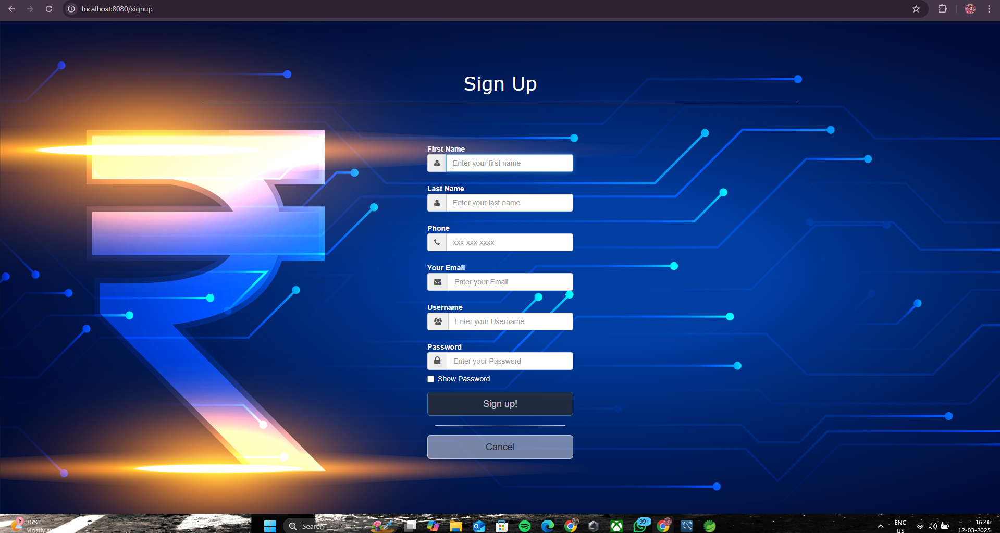
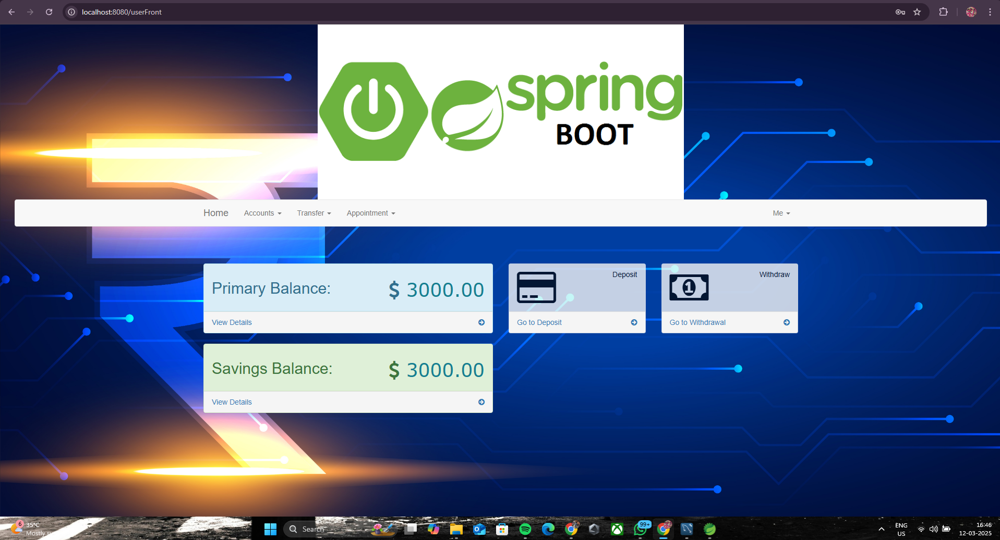
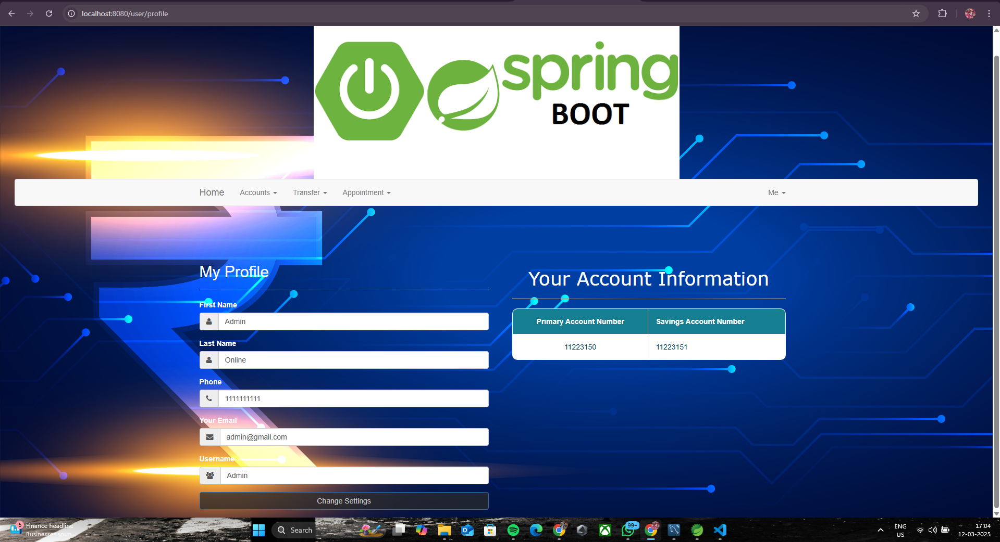
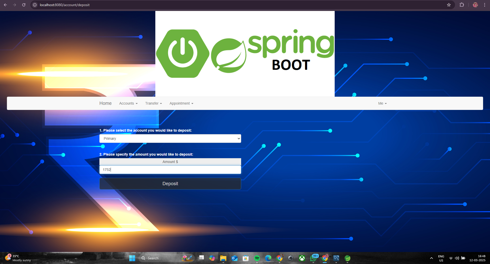

BankSim (Online Bank Simulator)

 BankSim is an online banking system simulation that allows users to register, log in, and manage their accounts.
 
 Users can deposit and withdraw money, transfer funds between accounts and recipients, add or edit recipients, view transaction histories, and schedule appointments.
 
 The system supports two roles: User and Admin. The admin panel, built with Angular 2, interacts with the backend via REST APIs.
 
 This project is containerized using Docker for seamless deployment.

Technologies Used :

Spring Boot – Backend framework

Spring Security – Authentication & Authorization

Spring Data JPA / Hibernate – ORM for database interaction

Flyway – Database versioning & migration

Lombok – Reducing boilerplate code

MySQL – Database

REST APIs – Communication between frontend & backend

Angular 2 – Admin panel frontend

Docker – Containerization for deployment

SIGNUP

DASHBOARD

PROFILE

DEPOSIT

